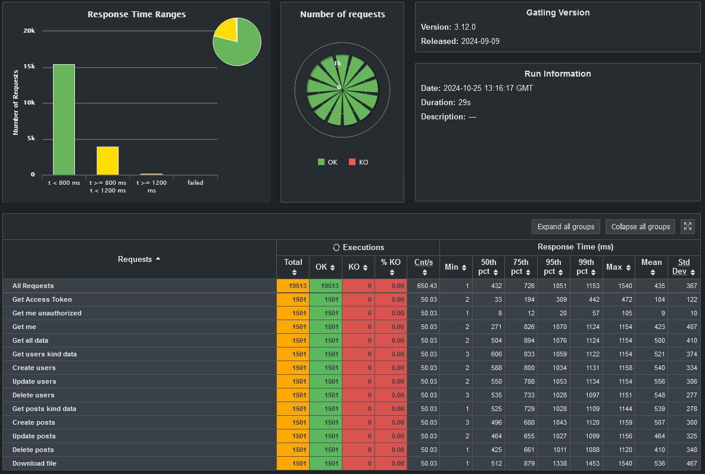

# Py-load-test

Py-load-test it's a simple study case project. For testing purposes, it has a simple API that returns a list of users/posts with a most basically authentication possible. The API is written in Python using FastAPI and the tests are written in TypeScript using Gatling.

# **My results**




## Run the project

Recommend to use docker to run the project.

```sh
docker build -t pyload .
docker run -p 8000:8000 pyload
```

Or you can run manually:

```sh
pip install -r requirements.txt
task start
```

Or using [UV Tool](https://docs.astral.sh/uv/getting-started/installation/)

```sh
uv sync --frozen
uv run task start
```

## Run the tests

```sh
cd ./testing/typescript
npm install
npx gatling run --simulation api-simulation
```

PS: If you already have the depencencies installed on the typescript folder, you can run from the root directory with taskipy tool:

```sh
task gatlingTest ## Manually installation
uv run task gatlingTest  ## Using uv tool
```